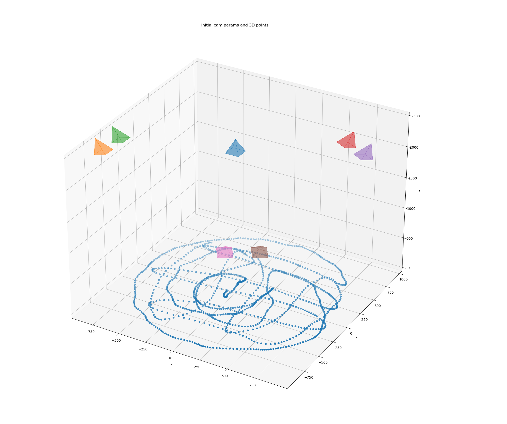

# laserCalib


## Install


Use conda to manage python virtual environment


```
conda create -n lasercalib python=3.9
conda activate lasercalib
conda install numpy
conda install -c anaconda scipy
conda install -c conda-forge matplotlib
conda install scikit-image
conda install -c menpo opencv
conda install seaborn
python -m pip install -U prettytable
```
We are using Linux. You will need to install `ffmpeg` on your machine such that the `ffmpeg` command works from the terminal. 


In laserCalib folder, install this library as a dev package
```
pip install -e  .
```


## Collect datasets 
1. Laser pointer videos 


- Use synchronized cameras. Turn off all the lights in the rig. This code is currently written for calibrating color cameras. If you are using monochrome cameras, please adjust the centroid-finding code to accept single channel images. If using color cameras, please use a green laser pointer. If you'd rather use a blue or red laser pointer, please adjust the centroid-finding code to use the red or blue image channel (right now it is using the green channel to find the green laser pointer centroid in each image). Use short (~100-500 microsecond) camera exposures and low gain such that the only bright spot in the image is from the laser pointer. The goal is to collect several thousand images on each camera of the laser pointer spot. You can shine the spot onto the floor of the arena (see example below).
- Collect laser point videos for two planes. Please also provide the ground truth z-plane in the calibration config file in the world frame. The ground truth z-planes are used for unprojecting 2d point to 3d.


2. Collect short videos of aruco markers. Aruco markers are used as global landmarks for the world frame registration. The center of the markers are used for registration. Users must provide ground truth 3d coordinates in the calibration config file.


3. Create a config file for calibration. Example config file is provided in the example folder.
 
4. If you are calibrating for the first time, please collect ~20 images of charuco board per camera to get a good initial estimation of camera parameters. Please refer to the next chapter for instructions. 

<strong>Example provided in the example folder</strong>. 


## Calibration steps


### Initial estimation
0. Initial estimation of the cameras parameters are crutial for bundle adjustment due to many local minimums in multiview optimization. There are many ways to calibrate a single camera. Here we are using Charuco board which we found works the best for larges images. 

#### Generate charuco pattern

We use tool from OpenCV to generate charuco patter. Please refer to this page for more details of [`gen_pattern.py`](https://docs.opencv.org/4.x/da/d0d/tutorial_camera_calibration_pattern.html). 


`python gen_pattern.py -o charuco_board.svg --rows 7 --columns 5 -T charuco_board --square_size 30 --marker_size 15 -f DICT_5X5_100.json.gz`

You can scale the image in an image editor before printing. Print the patter as a board or tape it to a rigid board. 


#### Intrinsics
Collect ~20 images per camera. It is recommended to cover the field of view of the camera. Here is an [example data](https://hhmionline-my.sharepoint.com/:f:/g/personal/yanj11_hhmi_org1/Ehaps9iLtK9Dk8cw-9TUPzABHXQ3TKLvKY6N2lrdLAYPVA?e=iJlEwj). 

```
python charuco_intrinsics.py -i [images_folder] -w 5 -h 7 -sl 80 -ml 40 -d 5 -o [output_folder]
```

The output is a yaml file with camera intrinsics. This output is used for the next step of estimating extrinsics. 

#### Extrinsics
Collect 1 image where the charuco board is placed at the world center, aligned with world coordinates. 

```
python charuco_extrinsics.py -i [images_folder]/Cam2005322_world.tif -w 5 -h 7 -sl 80 -ml 40 -d 5 -c [output yaml file from previous step]
```

The output is a yaml file contains both the intrinsics and extrinsics estimated using Charuco board. Please put the folder that contains camera initial parameter estimation in the same folder as the config file. 


### Bundle adjustment
Assume the `config.json` is in the folder `/media/user/data0/laser_calib_2024_05_02_tutorial/calib/results/calibration_rig/`


Go to the scripts subdirectory,


```
cd scripts 
export calib_dataset=/nfs/exports/ratlv/calibration/2024_10_08/
```


1. Extract laser points
```
python detect_laser_points.py -c $calib_dataset -i 0
python detect_laser_points.py -c $calib_dataset -i 1
```
-i specify the dataset index. Order is specified in the `config.json` file. 

or simply 
```
python detect_laser_points.py -c $calib_dataset
```
It will run on all the laser datasets listed in the config in sequence. 


2. infer 3d points
```
python get_points3d.py -c $calib_dataset
```


3. run calibration
```
python calibrate_camera.py -c $calib_dataset
```


4. run viewers to extract aruco markers, press `q` to exit. 
```
python run_viewers.py -c $calib_dataset -m aruco
```
The aruco markers for detection needs to be from dictionary `DICT_4X4_100`. Please specify the marker ids for detection in the `config.json` file.


5. triangulate aurco markers
```
python triangulate_aruco.py -c $calib_dataset
```


6. register to the world coordinate
```
python register_world.py -c $calib_dataset
```


7. To check on the results
```
python verify_world.py -c $calib_dataset
```


Final results are saved in $calib_dataset/results/calibration_rig/


### Some utility function:
1. `movie_viewer.py`: visualize laser detection, `python movie_viewer.py --n_cams=16 --root_dir=/home/user/Calibration/16cam --mode laser`.
2. `get_video_pixel.py`: find the pixel rgb value for mouse selectable pixel.


## Example of a suitable input image 
This is a suitable image. The green laser pointer is the brightest and largest green spot in the image. Good job. As written, the program will reject laser pointer points that are >1300 pixels from the center of the image.  
 


## Example of calibrated cameras and extracted laser points in world space 
 


## Reference 
The library is built on pySBA -- Python Bundle Adjustment library: https://github.com/jahdiel/pySBA 


Camera visualizer -- https://github.com/demul/extrinsic2pyramid 


Scipy bundle adjustment cookbook: http://scipy-cookbook.readthedocs.io/items/bundle_adjustment.html 


FFmpeg python wrapper: https://github.com/kkroening/ffmpeg-python 


Multiple view Camera calibration tool: https://github.com/cvlab-epfl/multiview_calib


## Acknowledgements 
We thank he authors of pyBSA (https://github.com/jahdiel), the Scipy Cookbook, and the Camera Visualizer Tool (https://github.com/demul) used in this project. We adapted their code (see Reference Section). We thank Selmaan Chettih (https://twitter.com/selmaanchettih) for advice and help in getting this project started with pyBSA. We thank David Schauder (https://github.com/porterbot) and Ratan Othayoth (https://github.com/othayoth) for help in synchronizing cameras. 


